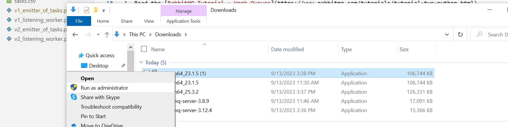
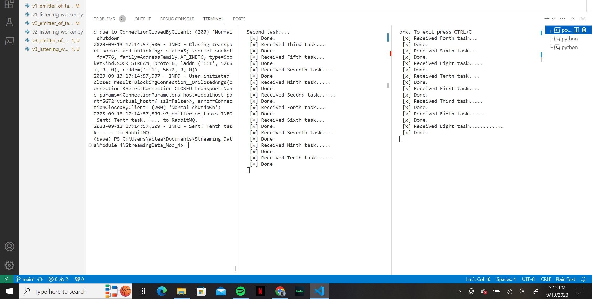

# streaming-04-multiple-consumers

> Use RabbitMQ to distribute tasks to multiple workers

One process will create task messages. Multiple worker processes will share the work. 

## Before You Begin

1. Fork this starter repo into your GitHub.
1. Clone your repo down to your machine.
1. View / Command Palette - then Python: Select Interpreter
1. Select your conda environment. 
    This was a bit confusing. I ended up choosing the "base" environment. It was the only one that allowed everything to work properly.

## Read

1. Read the [RabbitMQ Tutorial - Work Queues](https://www.rabbitmq.com/tutorials/tutorial-two-python.html)
1. Read the code and comments in this repo.

## Execute the Producer

1. Run emitter_of_tasks.py (say y to monitor RabbitMQ queues)
    In order to do this, I ran into a few problems with RabbitMQ and Pika. Initially, running the code kept giving me a problem with pika. It was telling me there was no module named pika, but I had already installed pika. The issue (I believe) is that I had pika installed, but not for my conda environment. I had to use a different syntax on conda. I was able to fix this by using the following code:

        conda install -c conda-forge pika

    After fixing the pika error, I was able to run the program. However, I kept getting a connectivity error telling me that it refused to connect. After reading the article Zach posted, I understood that I had downloaded the materials incorrectly; I didn't install the programs as an administrator. I fixed the problem by following the instructions on the article and ensuring I was installing as an administrator. You can do this by right-clicking on the downloaded program and selecting "run as administrator". See screenshot below:

        

## Execute a Consumer / Worker

1. Run listening_worker.py

    Q: Will it terminate on its own? How do you know?
    A: No, it will not terminate on its own. You can see this in the code itself. Under "Terminal Reminders" at the top of the file, it shows that you must use Control-C to close the terminal and end the process.  

## Ready for Work

1. Use your emitter_of_tasks to produce more task messages.

## Start Another Listening Worker 

1. Use your listening_worker.py script to launch a second worker. 

Follow the tutorial. 
Add multiple tasks (e.g. First message, Second message, etc.)
How are tasks distributed? 
Monitor the windows with at least two workers. 
Which worker gets which tasks?
        It looked as if the tasks go to whichever worker was free and available. 

## RabitMQ - Working with the Examples Questions
Q: Compare version 1 and version 2. Verify both perform the same logic.
    A: Aside from basic orgaization, the two versions complete the same thing. Version 2 blocks things up a bit more into custom functions.
Q: Which version is easier to change the queue name? Which is easier to change the host machine? Which is easier to modify the message sent?
    A: In all these variations, the answer is version 2. Because it is more blocked into custom functions, it allows you to change variables just once, rather than combing through the code to ensure everything aligns.

## Your Project - Version 3 - Automating the Tasks

In this portion, I kept a lot of the code the same from version 2. To help with reading in tasks from a .csv file, I went back to previous modules and used chatGPT. I needed the most help with changing all the printing to logging. Thankfully it wasn't terribly difficult.

Q: Should you hardcode the data filename? Or would it be helpful to assign the filename to a variable?
    A: For the longevity of this program and it's usefullness in future projects, it makes the most sense to assign the filename to a variable. That way you can customize it a bit more. 

- [RabbitMQ Tutorial - Work Queues](https://www.rabbitmq.com/tutorials/tutorial-two-python.html)

## Screenshot

See a running example with at least 3 concurrent process windows here:

